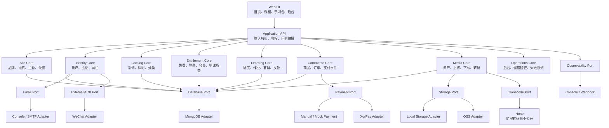
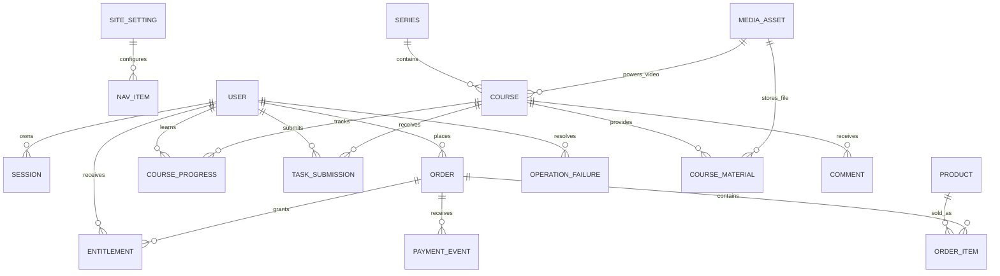
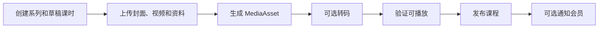
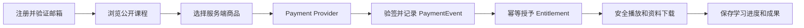
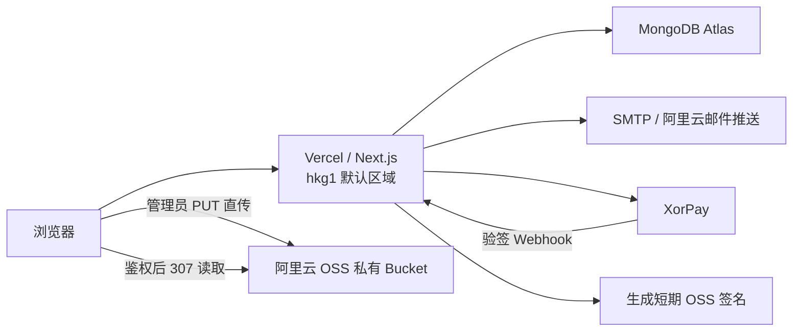
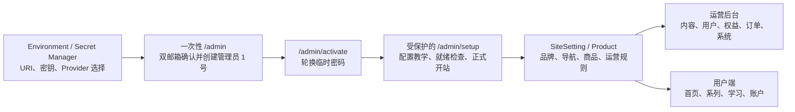

# 架构总览

## 1. 目标架构



核心约束：

> 领域模块决定业务规则，Provider 只负责外部服务调用；未配置某个 Provider 时，核心站点仍可降级运行。

## 2. 目标数据拓扑



关键变化：

- `Entitlement` 取代单一 `isVIP` 判断；
- `Product + OrderItem` 取代订单 JSON 中的商品信息；
- `PaymentEvent` 负责回调留痕和幂等处理；
- `MediaAsset` 统一视频、封面和课程资料；
- `OperationFailure` 聚合支付、转码、邮件与存储故障，不替代领域事实；
- 微信、飞书和 AI 网关信息不进入核心 `User`。

## 3. 三条关键业务流

### 创作者初始化

```mermaid
flowchart LR
    Clone["克隆仓库"] --> Env["复制 .env.example"]
    Env --> Check["运行 check-config"]
    Check --> DB["启动 MongoDB / Docker"]
    DB --> Start["启动知识站"]
    Start --> Admin["在 /admin 两次确认自己的邮箱"]
    Admin --> Credential["保存只展示一次的随机临时密码"]
    Credential --> Activate["设置正式密码并激活管理员 1 号"]
    Activate --> Setup["在 /admin/setup 完成开站任务"]
    Setup --> Seed["可选导入 Demo 课程"]
    Seed --> Launch["通过上线检查后开放网站"]
```



### 内容发布



### 购买与学习



## 4. 计划目录

```text
mdldm-knowledge-kit/
├── app/
├── components/
├── modules/
│   ├── site/
│   ├── identity/
│   ├── catalog/
│   ├── entitlement/
│   ├── commerce/
│   ├── media/
│   ├── learning/
│   └── operations/
├── providers/
│   ├── database/mongodb/
│   ├── storage/local/
│   ├── storage/oss/
│   ├── payment/manual/
│   ├── payment/xorpay/
│   ├── email/console/
│   ├── email/smtp/
│   └── observability/webhook/
├── config/
├── models/
├── scripts/
├── public/demo/
└── docs/
```

第一阶段保持一个 Next.js 仓库，不提前拆成复杂 Monorepo。

## 5. 推荐生产部署拓扑



- Vercel 负责页面、API、会话与权益编排，不持久保存媒体；
- Atlas 保存用户、Session、Token、限流、课程、权益和学习数据；
- OSS 保持私有，上传与读取都由短期签名授权；
- SMTP 只通过 Email Port 调用；
- XorPay 只负责支付协议，价格校验、PaymentEvent 和 Entitlement 仍在服务端领域流程；
- Preview 与 Production 必须使用隔离的数据和密钥。
- 第一版只维护 Agent + Vercel Serverless；Docker Compose 只提供本地 MongoDB；
- Preview 通过后才能申请 Production，两次外部变更分别由站长确认；
- `hkg1` 不属于中国大陆，也不提供大陆访问保证；正式上线前必须用自定义域名完成至少
  两个中国大陆网络点的首页、登录、后台、学习页和媒体验收；
- Agent 通过 `pnpm check:serverless` 读取脱敏技术状态，真实账号 L2/L3 与大陆网络证据
  仍由站长确认和保存。

这张图描述推荐目标，不代表公共仓库已经绑定真实第三方账号。每个部署者都必须在
自己的隔离环境中完成 Provider 验证。

## 6. Phase 7 初始化与运营配置边界



- `/admin` 的首次管理员入口只在尚无管理员时开放，站长两次输入自己的邮箱；生产环境还需要一次性初始化口令；
- 系统生成每次部署独立的随机临时密码，只返回并展示一次；完成正式密码轮换前，其他后台页面和接口拒绝访问；
- `/admin/setup` 不保存或展示第三方密钥，只读取 Provider 健康状态和业务就绪事实；
- 初始化状态与首个管理员创建必须具备一次性安全边界；
- SiteSetting 和 Product 是服务端事实，不能被客户端直接决定；
- 环境变量变更需要重新部署，日常运营设置不需要修改代码；
- 最低配置与按需能力的公开契约见 `docs/CAPABILITY_MATRIX.md`；未选择的外部能力不参与
  专属变量校验，并通过动态导入避免加载 OSS 与 SMTP SDK；
- 公共第一版不接受 S3、FFmpeg、Aliyun MPS 或 Sentry 作为配置值，扩展实现需要独立 ADR、
  健康检查与验收；
- 原项目只作为配置结构与运营旅程参考，真实值和私有插件不进入公共核心。
- Agent 先通过 `pnpm agent:status` 或受保护的 `/api/admin/agent-context` 读取同一份脱敏
  生命周期与能力事实；接口不返回站点域名、环境变量值、邮箱、URI、Token、Bucket 或
  业务数据；
- 后台故障交给 Agent 时只传递 category、code、Provider 和累计次数，detail、sourceId
  与原始载荷继续留在受保护后台；外部写入和发布仍由站长批准。
- `pnpm run doctor` 在 Operations 领域生成版本、能力、Provider 名称和固定检查结果；
  `pnpm run doctor --issue` 只在本地 `.mdldm/` 写入通过隐私扫描的草稿，不调用 GitHub，
  公开 Issue 必须由用户人工检查并提交，见 ADR 0017。
- SiteSetting 只保存 `mdldm / minimal` 白名单主题；根布局把结果映射为 `data-theme`，共享
  页面继续消费同一组语义 Token。主题不复制页面，也不得改变支付、权益和权限语义，
  见 ADR 0018。

## 7. Query Service 与安全 DTO 边界

```text
Page / Route Handler / Client Component
  -> Application Service / Query Service
  -> Domain rule + Repository Port
  -> MongoDB Repository / Provider Adapter
```

- Page、Route Handler 和 Client Component 禁止直接导入 MongoDB Model；
- Catalog、User、Learning 和 Commerce 读模型通过 Query Service 暴露；
- Query Repository Port 位于 `modules/*/queries.ts`，MongoDB 实现位于
  `providers/database/mongodb/repositories/`；
- Page 只接收字符串 ID、ISO 日期和必要业务字段，不接收 Mongoose Document；
- 学习权限由 Learning Query Service 与 Entitlement 领域规则计算，页面不自行判断；
- 新增功能按真实需求渐进收紧命令侧 Port，不做一次性全仓重写，见 ADR 0019。
