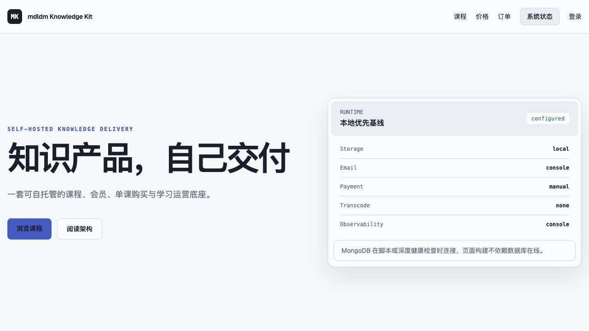

# mdldm Knowledge Kit

[](https://github.com/CzzzzzzJ/mdldm-knowledge-kit/actions/workflows/ci.yml)
[](https://github.com/CzzzzzzJ/mdldm-knowledge-kit/actions/workflows/codeql.yml)
[](https://github.com/CzzzzzzJ/mdldm-knowledge-kit/releases/latest)
[](LICENSE)

一套由个人创作者自行部署和控制的知识产品交付与会员运营底座。当前重点是把它交到一名
稍懂 Git、环境变量和 Vibe Coding 的 AI 博主手中，让他通过后台配置和少量 Agent
协作，把项目改造成自己的知识站。

项目由麦当 mdldm 发起，来自一个已经稳定运行的真实知识站实践。这里不会公开复制原站，而是重新提炼其中可复用的课程交付闭环，并将个人 IP、真实业务数据和私有服务隔离在公共核心之外。

> 当前版本：`v0.1.0 / Phase 7 operator-ready in progress`
>
> 课程交付、身份权益、全站会员与单课购买、运营总览、统一失败队列、签名告警、本地/OSS 存储与 Console/SMTP 邮件已经可运行。
> SiteSetting、内容发现、系列详情、学习中心、后台分区和一次性管理员初始化已经整合；
> 独立第三方账号 L2/L3 与中国大陆多网络验收尚未完成。因此当前版本仍是可运行的开发底座，
> 不是已经通过目标用户验收的开箱即营成品。



所有截图、账号、商品和课程内容均为虚构数据。完整演示路径见 [Demo 指南](docs/DEMO.md)。

## 要解决的问题

帮助已经拥有内容或知识产品的创作者，搭建一个支持以下能力的独立知识站：

- 邮箱注册、登录、验证与找回密码；
- 系列、课时、视频、资料和发布管理；
- 免费、登录可看、会员、单课等通用权益；
- 邀请码、订单、支付回调和幂等授权；
- 安全播放、资料下载、断点续播和学习进度；
- 课程、用户、权益、订单、媒体与系统状态后台；
- 可替换的支付、存储、邮件、转码和监控 Provider。

目标站长可以借助 Codex 或其他 Agent 完成 Fork、部署、第三方密钥配置、视觉改造和
故障排查；站点品牌、课程、商品、用户权益和订单等日常经营事实必须由后台管理，不应
长期依赖修改 TypeScript。当前差距、实施 Wave 和验收门槛见
[Vibe Coding AI 博主交付计划](docs/VIBE_CODING_CREATOR_PLAN.md)。

## v0.1 边界

第一版只聚焦“创作者发布知识产品，用户获得权益并完成学习”的核心闭环。

第一版明确不包含：

- 麦当个人页面、真实用户数据和个人营销素材；
- 麦子、AI 网关和 sub2api；
- 返佣、提现和复杂营销自动化；
- 固定飞书知识库、VIP 群和个人 Webhook；
- 微信小程序、MDTI、M-Agent；
- 多租户 SaaS。

## 核心原则

1. 新仓白名单开发，不复制私有仓库历史。
2. 领域模块决定业务规则，Provider 只调用外部服务。
3. 没有第三方服务配置时，Demo 站仍应可运行。
4. 商品价格只能由服务端 SKU 决定。
5. 权限统一由 Entitlement 判定。
6. 所有媒体统一进入 MediaAsset。
7. 公共仓库只使用虚构 Demo 数据。

## 文档入口

- [15 分钟唯一启动入口](START_HERE.md)
- [交给 Agent 的本地启动协议](AGENT_QUICKSTART.md)
- [Agent + Serverless 唯一线上协议](AGENT_SERVERLESS_DEPLOY.md)
- [项目定义](PROJECT.md)
- [开发任务](TASKS.md)
- [架构总览](ARCHITECTURE.md)
- [开发路线图](docs/ROADMAP.md)
- [Vibe Coding AI 博主交付计划](docs/VIBE_CODING_CREATOR_PLAN.md)
- [Phase 7 小白可运营用户旅程](docs/OPERATOR_READY_JOURNEY.md)
- [第三方 Provider 配置提取与验证](docs/PROVIDER_VALIDATION.md)
- [本地开发](docs/DEVELOPMENT.md)
- [生产部署与第三方 Provider](docs/DEPLOYMENT.md)
- [虚构 Demo 与验收路径](docs/DEMO.md)
- [数据备份与恢复](docs/BACKUP_AND_RECOVERY.md)
- [升级与回滚](docs/UPGRADING.md)
- [Release 流程](docs/RELEASE.md)
- [更新日志](CHANGELOG.md)
- [第三方许可证说明](THIRD_PARTY_NOTICES.md)
- [安全基线](docs/SECURITY_BASELINE.md)
- [架构决策](docs/decisions/README.md)
- [贡献指南](CONTRIBUTING.md)

## 技术基线

- Next.js 15.5
- React 19.2
- TypeScript 5.9
- MongoDB / Mongoose 8
- Tailwind CSS 4
- 单仓模块化架构
- Local / 阿里云 OSS Storage
- Console / SMTP Email
- Manual / Mock / XorPay Payment
- Structured Console / signed Webhook Observability

当前可以运行“注册验证 → 会员或单课下单 → 显式 Mock 测试支付 → 幂等获得权益 → 观看受控课程 → 后台查看指标与故障”的完整 Demo。`v0.1.0` 是首个公开版本，升级前请同时阅读 [已知限制](CHANGELOG.md#已知限制)。

## 快速启动

本地第一次运行只走 [`START_HERE.md`](START_HERE.md)，不要从文档索引中拼装步骤。要把
启动工作交给 Coding Agent，直接发送 [`AGENT_QUICKSTART.md`](AGENT_QUICKSTART.md)
中的 Prompt。系统会让站长两次确认自己的邮箱，将其作为管理员 1 号，并强制轮换只展示
一次的随机临时密码。

Docker Compose 只用于启动本地 MongoDB，不是生产部署方案。

## 生产部署与第三方平台

第一版只维护 [`Agent + Vercel Serverless`](AGENT_SERVERLESS_DEPLOY.md) 这一条线上路径。
当前视频知识站公开运营组合是 `Vercel + Atlas + OSS + SMTP + Manual`；需要自动支付时
才把 Manual 替换为 XorPay。完整生产 Docker 和其他 Web 平台不在第一版支持范围。

当前推荐组合：

| 能力 | 本地开发 | Vercel 推荐 |
| --- | --- | --- |
| Web | `pnpm dev` | Vercel Next.js / Node.js 22 / `hkg1` |
| 数据库 | Docker MongoDB | MongoDB Atlas |
| 媒体 | Local Storage | 阿里云 OSS 私有 Bucket |
| 邮件 | Console Email | SMTP / 阿里云邮件推送 |
| 支付 | Manual / 显式 Mock | Manual 或 XorPay |
| 监控 | Structured Console | 签名 Webhook |

### 1. Vercel

1. 从 Git 仓库导入项目，Framework 使用 Next.js，Node.js 选择 22；
2. 在 Project Settings → Environment Variables 分别配置 Preview 与 Production；
3. Production 的 `APP_URL` 必须是最终 HTTPS 域名；
4. 配置下面的 Atlas、OSS、SMTP 变量后重新部署；
5. 先部署 Preview，再运行 `pnpm check:serverless --url <Preview HTTPS 根地址>`；
6. 完成 L2/L3 与国内多网络验收后，另行确认 Production 发布。

Vercel Functions 存在请求和响应体限制，不能使用 Local Storage 持久保存课程视频。本项目在 OSS 模式下使用浏览器直传和鉴权后的 5 分钟签名读取，媒体字节不会穿过 Vercel Function。

仓库默认函数区域为香港 `hkg1`，但 Vercel 官方明确其没有中国大陆基础设施，自定义域名
也不能保证大陆可用性和性能。正式发布前必须用自定义域名，从至少两个中国大陆网络点
验收首页、登录、后台、学习页与媒体；没有证据时不得写成“国内生产可用”。

### 2. MongoDB Atlas

1. 创建 Cluster 和专用 Database User；
2. 在 Network Access 配置应用来源；
3. 从 Connect → Drivers 复制 SRV URI 到 `MONGODB_URI`；
4. Preview 与 Production 使用不同数据库和账号；
5. 开启备份、成本告警并使用强随机密码。

Vercel 使用动态出口 IP。Atlas 的 Vercel 集成可能使用 `0.0.0.0/0`；采用时务必依赖 TLS、最小数据库权限和独立强密码，不能把 Atlas 登录账号当作数据库账号。

### 3. 阿里云 OSS

Bucket 必须设为私有并开启 Block Public Access。使用专用 RAM 身份，只授予目标 Bucket 前缀所需的 `GetObject`、`PutObject` 和 `DeleteObject` 权限：

```dotenv
STORAGE_PROVIDER=oss
OSS_REGION=oss-cn-hangzhou
OSS_BUCKET=replace-with-private-bucket
OSS_ENDPOINT=
OSS_ACCESS_KEY_ID=replace-with-ram-or-sts-key
OSS_ACCESS_KEY_SECRET=replace-with-secret
OSS_SESSION_TOKEN=
```

后台直传需要为正式域名配置 OSS CORS：

```text
Origins: https://你的正式域名
Methods: PUT, GET, HEAD
Allowed Headers: Content-Type
Expose Headers: ETag, Content-Length
```

Preview 域名应单独加入，不建议使用 `*`。从 Local 切换 OSS 不会自动迁移已有媒体，生产上传前先冻结 Provider 选择。

### 4. SMTP / 阿里云邮件推送

```dotenv
EMAIL_PROVIDER=smtp
EMAIL_FROM=Knowledge Kit <sender@example.com>
SMTP_HOST=smtpdm.aliyun.com
SMTP_PORT=465
SMTP_SECURE=true
SMTP_USER=sender@example.com
SMTP_PASSWORD=replace-with-smtp-password
```

阿里云 SMTP 用户名必须与已配置发信地址一致；SMTP 密码不是阿里云账号密码。上线前完成发信域名、DNS 和发信地址验证。

### 5. Manual、Mock 与 XorPay

安全默认使用 Manual：

```dotenv
PAYMENT_PROVIDER=manual
```

Mock 只有显式设置 `PAYMENT_PROVIDER=mock` 时才用于非生产测试，生产配置校验会直接拒绝。
Manual 由管理员在订单后台核对并确认：

```dotenv
PAYMENT_PROVIDER=manual
MANUAL_PAYMENT_INSTRUCTIONS=请转账后联系管理员，并提供订单号。
```

接入 XorPay：

```dotenv
PAYMENT_PROVIDER=xorpay
XORPAY_AID=replace-with-xorpay-aid
XORPAY_APP_SECRET=replace-with-xorpay-app-secret
# 留空时自动使用 APP_URL/api/payments/webhooks/xorpay
XORPAY_NOTIFY_URL=https://your-domain.example/api/payments/webhooks/xorpay
```

1. 在 XorPay 后台取得 AID 与 App Secret；
2. 在 Vercel Production 环境配置以上变量，不能添加 `NEXT_PUBLIC_` 前缀；
3. 确保回调地址是公网 HTTPS，并允许 XorPay 无登录 POST；
4. 重新部署后运行 `pnpm check-config`；
5. 用隔离的低价测试商品完成一次支付宝或微信 Native 支付；
6. 在 `/admin` 确认订单为 `fulfilled / fulfilled`，再恢复正式商品价格并重新同步。

XorPay 回调会先验签，再核对订单 Provider、服务端金额和币种。`PaymentEvent` 以 Provider 事件 ID 幂等留痕；重复通知不会重复创建 Entitlement。授权失败会保留支付成功事实，并在后台提供重试入口。

切换支付 Provider 前应先处理完旧 Provider 的待支付订单，并保留旧回调密钥一段时间。Preview 应使用独立 XorPay 测试配置或 Manual，不要与 Production 共用订单和数据库。

### 6. 结构化日志与通用 Webhook 告警

默认配置会向服务端输出单行 JSON 结构化日志：

```dotenv
OBSERVABILITY_PROVIDER=console
```

生产环境建议把主要故障同步到自建 Vercel Function、自动化平台或告警中继：

```dotenv
OBSERVABILITY_PROVIDER=webhook
OBSERVABILITY_WEBHOOK_URL=https://alerts.example.com/hooks/mdldm
OBSERVABILITY_WEBHOOK_SECRET=replace-with-at-least-32-random-characters
```

Webhook 请求包含 `X-MDLDm-Timestamp` 与 `X-MDLDm-Signature`。接收方应使用原始请求体计算 `HMAC-SHA256(secret, timestamp + "." + rawBody)`，并拒绝超过 5 分钟的时间戳。不要把 Secret 放进 URL 或 `NEXT_PUBLIC_` 变量。

Slack、飞书、Teams 等平台通常有自己的消息格式和签名协议，不建议把平台机器人地址直接填入本项目。用一层 Vercel Function/Serverless 中继先校验本项目签名，再转换为目标平台格式；这样可以轮换目标平台 Webhook 而不改业务站配置。

支付、邮件和存储错误会聚合到 `/admin` 的统一失败队列。公共第一版不接受 Sentry 与
转码 Provider 配置值，也不会静默降级为 Console。

### 7. 必填生产变量

```dotenv
NODE_ENV=production
APP_URL=https://your-domain.example
APP_NAME=mdldm Knowledge Kit
MONGODB_URI=mongodb+srv://...
AUTH_SECRET=replace-with-at-least-32-random-characters
INITIAL_SETUP_TOKEN=replace-with-one-time-setup-token
```

这是生产最低核心。当前视频站若要公开运营，还需 OSS 与 SMTP；Manual 无需支付密钥，
XorPay 和 Webhook 按需启用。运行 `pnpm check-config` 会拒绝生产环境中的 Mock Payment、
HTTP `APP_URL`、不完整的已启用 Provider 和弱 `AUTH_SECRET`；`pnpm check:serverless` 检查
唯一线上路径，但不能替代真实账号 L2/L3 与国内网络验收。完整步骤见
[生产部署与第三方 Provider](docs/DEPLOYMENT.md)。

生产上线前同时配置 Atlas 与 OSS 备份，并实际做一次隔离恢复演练；管理员 JSON 导出不包含凭据，也不能替代完整备份。操作步骤见 [数据备份与恢复](docs/BACKUP_AND_RECOVERY.md)。

## 质量检查

```bash
pnpm check
pnpm release:audit
pnpm test:e2e
pnpm validate:providers
```

`release:audit` 会检查公开仓库必需文件、本机绝对路径、疑似密钥、非示例邮箱、带凭据的 MongoDB URI、误提交运行数据与依赖许可证。CI 还会执行 `pnpm audit`，GitHub 仓库启用了 Dependabot、Secret Scanning、Push Protection、CodeQL 与私密漏洞报告。

`pnpm check` 的生产构建使用隔离的 HTTPS 与 Manual Payment 测试配置；正式部署仍须用真实环境变量单独运行 `pnpm check-config`。

`pnpm validate:providers --live` 执行 MongoDB、Storage 和 Email 的无副作用
连接检查，不发送邮件、不创建支付订单，也不写入 OSS。验证分级和当前记录见
[第三方 Provider 配置提取与验证](docs/PROVIDER_VALIDATION.md)。

## 开发准备

开始实现前先阅读：

1. `PROJECT.md`
2. `ARCHITECTURE.md`
3. `TASKS.md`
4. `docs/SECURITY_BASELINE.md`
5. `AGENTS.md`

## License

本项目公共核心采用 [Apache License 2.0](LICENSE)。该许可证不授予 `mdldm`、麦当相关名称、Logo 或其他商标的额外使用权。
