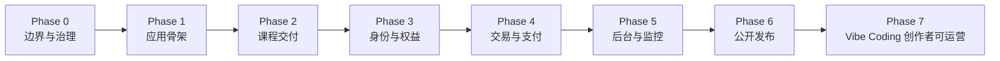

# 开发路线图

## Phase 0：边界与治理

目标：建立新仓、产品边界、许可证、安全基线和架构事实源。

退出条件：项目名、许可证、权益范围均有 ADR；旧功能都有公开边界标签。

## Phase 1：应用骨架

目标：在无付费第三方服务时启动一个可验证的空白 Demo 站。

主要交付：

- Next.js、React、TypeScript、Tailwind；
- MongoDB、本地 Provider 和 Feature Flags；
- 环境校验、创建管理员、Demo Seed；
- CI 质量门。

## Phase 2：课程交付

目标：完成系列、课时、媒体、资料和学习进度闭环。

关键依赖：MediaAsset 与 Local Storage Provider。

## Phase 3：身份与权益

目标：建立统一、可测试的身份和 Entitlement 权限模型。

关键风险：角色注入、会话安全、越权访问和到期回收。

## Phase 4：交易与支付

目标：通过 Provider 完成服务端定价、支付验签、幂等事件和权益授予。

关键风险：客户端改价、重复回调和支付成功但授权失败。

## Phase 5：后台与监控

目标：让创作者在后台完成日常运营并发现主要故障。

状态：已完成。

关键交付：运营数据总览、统一失败队列、健康检查、结构化日志、签名 Webhook 告警、管理员导出与备份恢复手册。

## Phase 6：公开发布

目标：完成陌生环境安装、隐私扫描、发布文档和 v0.1 Release。

状态：已完成。

关键交付：15 分钟全新安装验收、虚构 Demo 与截图、升级和回滚手册、公开发布审计、GitHub 社区模板与 `v0.1.0` Release。

发布门槛：一名不了解原项目的贡献者可以只读 README 跑通完整主流程。

## Phase 7：Vibe Coding 创作者可运营

目标：让不了解 Next.js、但稍懂 Git、环境变量和 Vibe Coding 的 AI 博主，在 Agent
协助下完成部署与个性化；第三方平台配置完成后，通过后台完成站点初始化、品牌设置、
商品配置、课程发布、用户与订单运营。

状态：进行中。

实施 Wave：

1. `Wave A / DONE`：SiteSetting 公共接入、品牌首页、搜索、分类、Tag、系列
   详情、学习中心和基础后台分区；
2. `Wave B / IN PROGRESS`：商品和连续学习已完成，继续补齐内容完整 CRUD、用户、
   权益和分析后台；
3. `Wave C / IN PROGRESS`：一次性管理员初始化、后台开站指南、上线门禁和
   Agent + Vercel Serverless 部署协议已完成；其余任务级 Prompt 继续补齐；
4. `Wave D / TODO`：开源版独立 Preview、L2/L3、中国大陆多网络、备份恢复和目标
   AI 博主验收。

技术架构继续使用 `modules / providers / config` 边界，不复制原项目目录、数据或
私有业务。详细目标、距离和完成定义见 `docs/VIBE_CODING_CREATOR_PLAN.md`，
用户旅程见 `docs/OPERATOR_READY_JOURNEY.md`，Provider 验证见
`docs/PROVIDER_VALIDATION.md`。

具体任务状态以仓库根目录 `TASKS.md` 为准。
