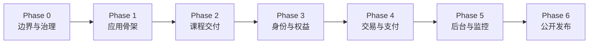

# 开发路线图

## Phase 0：边界与治理

目标：建立新仓、产品边界、许可证、安全基线和架构事实源。

退出条件：项目名、许可证、权益范围均有 ADR；旧功能都有公开边界标签。

## Phase 1：应用骨架

目标：在无付费第三方服务时启动一个可验证的空白 Demo 站。

主要交付：

- Next.js、React、TypeScript、Tailwind；
- MongoDB、本地 Provider 和 Feature Flags；
- 环境校验、创建管理员、Demo Seed；
- CI 质量门。

## Phase 2：课程交付

目标：完成系列、课时、媒体、资料和学习进度闭环。

关键依赖：MediaAsset 与 Local Storage Provider。

## Phase 3：身份与权益

目标：建立统一、可测试的身份和 Entitlement 权限模型。

关键风险：角色注入、会话安全、越权访问和到期回收。

## Phase 4：交易与支付

目标：通过 Provider 完成服务端定价、支付验签、幂等事件和权益授予。

关键风险：客户端改价、重复回调和支付成功但授权失败。

## Phase 5：后台与监控

目标：让创作者在后台完成日常运营并发现主要故障。

关键交付：失败队列、健康检查、结构化日志和通用告警。

## Phase 6：公开发布

目标：完成陌生环境安装、隐私扫描、发布文档和 v0.1 Release。

发布门槛：一名不了解原项目的贡献者可以只读 README 跑通完整主流程。

具体任务状态以仓库根目录 `TASKS.md` 为准。

