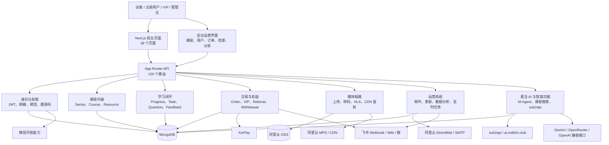
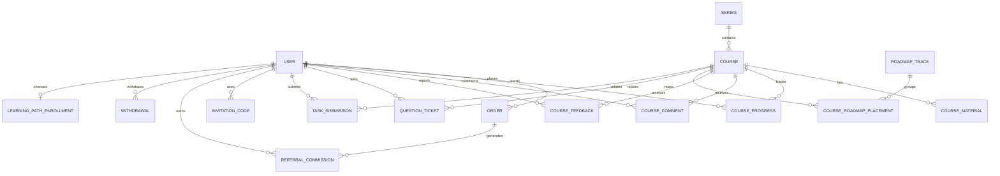
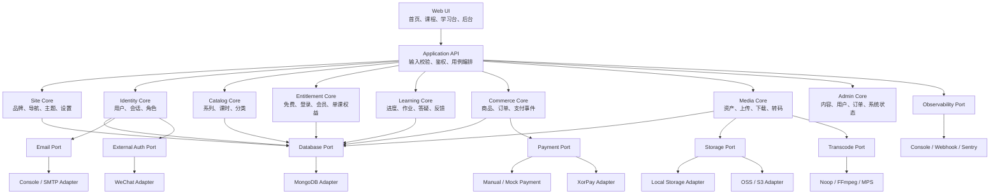
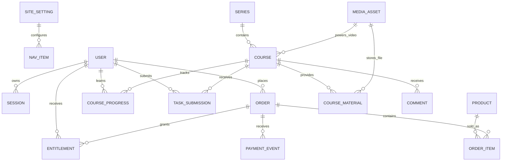
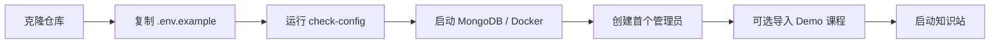
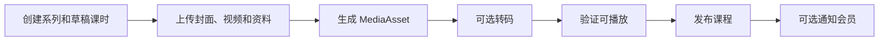
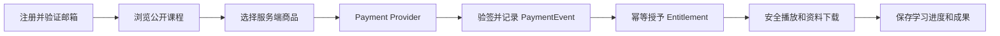

# 知识站开源版：现状分析、功能边界与目标拓扑

日期：2026-07-23  
分析对象：本机私有知识站仓库（路径不进入公共版本）
当前分支：`staging`  
分析基线：`818ae5c fix: restore course publishing and AI autofill`

## 一、结论先行

当前仓库具备很高的开源产品价值，但不适合直接公开。

更准确地说：

- **产品能力可复用度：7/10**。注册、会员、课程、视频、资料、学习进度、后台和运营分析已经形成完整闭环。
- **当前代码直接开源准备度：4/10**。个人 IP、业务数据、支付逻辑、飞书、微信、AI 网关和阿里云资源深度耦合。
- **完成新仓剥离后的开源潜力：8/10**。如果采用“核心领域 + 可插拔服务商 + 站点配置”的结构，可以成为个人创作者知识站的可靠底座。

推荐路线不是把当前仓库复制出去再删，而是：

> 新建一个没有旧 Git 历史的公开仓库，以白名单方式抽取课程交付闭环，再把支付、存储、邮件、登录和监控改成 Provider 适配器。

第一版开源产品应解决一个明确问题：

> 让已有知识产品的创作者，可以搭建一个支持注册、会员权限、课程视频、学习资料、付费、学习进度和后台运营的独立知识站。

它不应该在第一版同时解决 AI 网关、返佣提现、微信小程序、飞书知识库、AI 人格测试、个人作品集和复杂营销自动化。

## 二、当前仓库事实快照

| 项目 | 当前状态 |
| --- | --- |
| 技术栈 | Next.js 15.5.7、React 19、TypeScript、MongoDB/Mongoose、Tailwind CSS |
| 页面 | 39 个 `page.tsx` |
| API | 126 个 App Router API 路由 |
| 数据模型 | 24 个 Mongoose Model |
| 组件 | 58 个组件 |
| 核心源码 | `app/`、`components/`、`lib/`、`models/` 共 292 个文件 |
| 品牌/私有业务耦合 | 101 个文件包含麦当、mdldm、麦子、飞书或 sub2api 相关内容 |
| 对象存储 | 阿里云 OSS，部分上传采用服务端上传，部分采用签名直传 |
| 视频 | OSS + 阿里云 MPS + CDN 鉴权 + 三档 HLS（360p/720p/1080p） |
| 支付 | XorPay，支持 VIP、积分历史逻辑和麦子充值 |
| 登录 | 邮箱密码、邮箱验证、JWT Cookie、微信登录、二维码绑定/登录、API Token |
| 后台 | 课程、用户、邀请码、资源、订单、评论、邮件、学习分析、路径、项目、AI 管理 |
| 监控 | Vercel Analytics、后台聚合、Feishu 错误告警、定时日报和转码巡检 |
| 测试 | 没有自动化测试文件，也没有 `test` 脚本 |
| 构建基线 | 在当前私人环境变量下，`npm run build` 生成了有效 `.next/BUILD_ID` |

这里的构建通过只能证明当前工作站的私人配置可以构建，不能证明开源用户在全新环境可以部署。

## 三、当前网站能力拓扑



这个拓扑说明当前系统本质上是一个模块很多、边界较弱的单体应用。前台和后台共享 API、Model 与第三方实现，个人业务能力直接进入用户和订单主模型。

## 四、当前核心数据拓扑



当前数据模型有三个需要在开源版中重新定义的核心问题：

1. **权益模型过于单一**：权限主要依赖 `User.isVIP + vipExpiration`，无法自然表达单课购买、系列购买、多档会员或永久权益。
2. **个人业务进入主用户模型**：微信、飞书、麦子、sub2api API Key、返佣余额全部堆在 `User` 上。
3. **媒体缺少统一资产模型**：课程直接保存 `videoUrl/hlsUrl`，资料和独立资源各自保存文件地址，无法统一管理孤儿文件、存储迁移、转码状态和安全策略。

## 五、开源版应该保留的核心功能

### 5.1 P0：第一版必须保留

| 模块 | 应保留能力 | 当前证据 | 开源版调整 |
| --- | --- | --- | --- |
| 站点配置 | 名称、Logo、域名、主题、页脚、联系方式 | 当前散落在 `app/layout.tsx`、`components/header.tsx` 和页面中 | 新增统一 `site.config.ts` 和后台基础设置 |
| 用户系统 | 注册、登录、退出、邮箱验证、忘记密码、修改密码 | `app/api/auth/*`、`models/User.ts` | 合并重复注册入口，禁止客户端指定角色，增加速率限制 |
| 角色权限 | 普通用户、内容管理员、超级管理员 | 当前只有 `user/admin` | 至少抽象 `user/admin`，后续再扩展权限表 |
| 内容模型 | 系列、课时、分类、封面、简介、排序、发布状态 | `Series`、`Course` | 保留并清理字段，禁止依赖麦当课程分类 |
| 视频播放 | 安全播放地址、MP4/HLS、断点续播、清晰度切换 | `VideoPlayer.tsx`、课程 video/HLS API | 保留能力，解耦阿里云实现 |
| 学习进度 | 播放时间、完成状态、继续学习、系列进度 | `CourseProgress`、`/api/learn` | 作为开源核心保留 |
| 资料系统 | 课程资料上传、下载、权限判断 | `CourseMaterial`、课程 materials API | 保留，统一进入媒体资产层 |
| 会员与权益 | 免费、登录可看、会员可看、到期时间 | `isVip`、`isVIP`、视频权限 API | 改成通用 `accessLevel + Entitlement` |
| 支付订单 | 创建订单、支付回调、幂等确认、授予权益 | `Order`、`/api/pay/*` | 保留领域能力，支付服务商必须可插拔 |
| 邀请码 | 无支付情况下授予试用或会员权益 | `InvitationCode` | 保留，适合开源站冷启动和手工售卖 |
| 后台 CMS | 系列/课时增删改、封面/视频/资料上传、发布状态 | `app/admin`、`AdminSeriesCoursesPanel` | 保留并简化为通用后台 |
| 用户后台 | 用户搜索、角色、会员到期、禁用状态 | `AdminUsersPanel` | 保留；真正补齐 `status` 字段 |
| 订单后台 | 订单、状态、金额、失败重试 | `AdminOrdersPanel` | 保留，但移除麦子专用字段和面板 |
| 基础监控 | 健康检查、错误日志、支付失败、转码失败、存储失败 | `instrumentation.ts`、后台统计、Cron | 保留能力，告警渠道做 Provider |
| 部署引导 | 环境变量示例、数据库初始化、管理员创建、示例数据 | 当前缺失 | 开源版必须新增 |

### 5.2 P1：建议保留，但允许关闭

| 模块 | 结论 | 原因 |
| --- | --- | --- |
| 课程评论 | 可选保留 | 对交付和社区感有价值，但需要审核与反垃圾 |
| 课程问题反馈 | 可选保留 | `太快/听不清/卡顿/过时` 是知识站很实用的产品能力 |
| 答疑工单 | 可选保留 | 能把零散答疑沉淀成课程补丁 |
| 作业提交 | 可选保留 | 适合训练营和结果型课程，不是所有站点都需要 |
| 学习路径 | 可选保留 | 差异化强，但当前与麦当 AI Infra 路线绑定，需要通用化 |
| 项目/成果展示 | 可选保留 | 对知识付费信任和用户成果展示有效 |
| 独立资源库 | 可选保留 | 适合模板、工作流、资料包交付 |
| 站点更新中心 | 可选保留 | 适合持续更新型会员产品 |
| 邮件通知 | 可选保留 | 邮箱验证是 P0；营销邮件与课程通知属于 P1 |
| 经营分析 | 可选保留 | 用户、收入、学习进度值得保留，但指标要通用化 |

### 5.3 P2：不进入首个开源版本

| 模块 | 处理方式 |
| --- | --- |
| 推荐返佣与提现 | 移到 `plugins/referral`，首版不发布 |
| AI 工具额度与麦子 | 从核心完全剥离，作为独立商业插件 |
| sub2api 用户同步与 API Key | 从 `User`、`Order` 和后台移除 |
| 微信小程序登录与绑定 | 作为可选 Auth Provider，首版默认关闭 |
| 飞书知识库自动授权 | 作为支付成功后的可选 Webhook 插件 |
| 飞书 VIP 群邀请 | 作为可选社区 Provider |
| 批量营销与 D+3/D+7/D+30 | 后续营销插件，不进入核心 |
| AI 课程搜索/分类 | 后续 AI Provider，不影响基础课程搜索 |

## 六、必须从开源核心剥离的个人 IP 功能

### 6.1 页面与内容

以下内容不能直接进入公共核心仓库：

- `app/about` 中的麦当履历、照片、活动和社交链接；
- `app/ai-course-promotion` 的个人课程销售页、用户案例和优惠码；
- `app/enterprise` 的麦当企业培训介绍；
- `app/mdti` 与 `lib/mdti` 的个人 AI 学习人格测试；
- `app/ai-presentation`、`app/_tutorials` 等个人内容页；
- `public/feedback-review-2026` 的用户回信、抽奖和复盘站；
- `public/mdldm.jpg`、个人头像、个人案例截图、社交平台 Logo 和宣传素材；
- 首页中麦当本人、麦当 AI、个人项目和个人课程的固定模块；
- `app/courses/agent-course`、`coze-course`、`openclaw-course` 等硬编码课程落地页。

开源仓库可以提供虚构的 Demo Creator、两套示例课程和占位图片，但不能携带真实用户评价、真实收入、真实群链接和个人营销素材。

### 6.2 个人业务系统

以下能力属于麦当业务插件，不属于知识站核心：

- `lib/mdldmAI/*` 和 `app/api/ai-tools/*`；
- 麦子充值、余额、首次赠送、VIP 赠送和首充双倍；
- `app/admin/ai-tools`、麦子分析和 sub2api iframe；
- `M-Agent` 专属优惠券与固定购买链接；
- 飞书 Wiki 固定空间、VIP 群、Webhook 日报和个人通知；
- 推荐码返佣、佣金冻结、结算与提现账户；
- 个人渠道枚举，例如 Coze 官方、B 站、小红书、抖音；
- 麦当课程的 D+3、D+7、D+30 营销邮件与固定优惠码。

### 6.3 品牌文字与链接

当前有大量硬编码内容需要集中配置或删除：

- `麦当mdldm的知识站`；
- `mdldm.club`、`www.mdldm.club`、`ai.mdldm.club`；
- `mdldm` OSS Bucket 与 CDN 域名；
- 个人微信、B 站、抖音、小红书链接；
- 固定飞书 Wiki Space、Chat ID 和课程资料地址；
- 固定优惠码 `MDLDM_AI_2026`、`EMAIL50`、`TRIAL100`；
- 课程群“添加麦当老师微信”的说明；
- 邮件落款、后台页脚和 SEO Metadata。

这些内容应统一进入：

```ts
export const siteConfig = {
  name: 'Creator Knowledge Station',
  description: '...',
  logo: '/logo.svg',
  domain: 'http://localhost:3000',
  creator: {
    name: 'Demo Creator',
    avatar: '/demo/avatar.png',
    socials: [],
  },
  support: {
    email: 'support@example.com',
  },
};
```

生产配置可以来自数据库，仓库中的默认值只能是无隐私的示例。

## 七、需要特殊化处理的通用能力

“特殊化处理”不是删除，而是把业务接口和服务商实现分开。

### 7.1 支付

当前问题：

- `POST /api/pay` 接受客户端传入的 `price`、`name` 和 `order_uid`；
- 商品价格不是服务端 SKU 的唯一事实源；
- 支付路由同时处理 VIP、历史积分和麦子充值；
- 支付成功后同时修改 VIP、飞书权限、返佣和 AI 余额；
- `User.isVIP` 无法表达单课、系列和多档套餐。

开源目标：

```ts
interface PaymentProvider {
  createCheckout(input: CheckoutInput): Promise<CheckoutSession>;
  verifyWebhook(request: Request): Promise<PaymentEvent>;
  queryPayment(providerOrderId: string): Promise<PaymentStatus>;
}
```

服务端必须通过 `productId` 查询本地 SKU，计算价格和权益，客户端不能提交最终金额。

第一版建议提供：

- `ManualProvider`：邀请码或后台手工开通；
- `MockProvider`：本地开发；
- `XorPayProvider`：由现有代码抽取的示例适配器。

后续可以增加 Stripe、微信支付或支付宝 Provider，但不能进入核心领域代码。

### 7.2 存储与素材

当前问题：

- OSS Bucket、Region 和域名存在默认麦当值；
- URL 直接进入课程和资源模型；
- 没有统一媒体资产表，删除课程后可能留下孤儿文件；
- 图片、视频、课程资料和独立资源采用多套上传流程。

开源目标：

```ts
interface StorageProvider {
  createUpload(input: UploadRequest): Promise<UploadSession>;
  getDownloadUrl(objectKey: string, expiresIn: number): Promise<string>;
  deleteObject(objectKey: string): Promise<void>;
}
```

新增 `MediaAsset`：

```text
id / ownerId / kind / objectKey / mimeType / size / status
provider / visibility / checksum / duration / transcodeStatus
createdAt / updatedAt
```

开发环境默认本地存储，生产环境提供 S3 兼容与阿里云 OSS 适配器。

### 7.3 视频转码和播放

应保留的产品能力：

- 安全播放链接；
- MP4 降级播放；
- HLS 多码率；
- 清晰度切换；
- 播放进度和续播；
- 转码状态和失败重试；
- 新视频完成前继续播放旧视频。

需要剥离的实现：

- 阿里云 MPS Pipeline ID；
- 三个固定模板 ID；
- OSS/CDN A 类型鉴权细节；
- `video.mdldm.club` 和固定 Bucket；
- 飞书新课通知。

建议定义 `TranscodeProvider`，首版支持：

- `none`：直接 MP4；
- `ffmpeg-local`：开发和自托管；
- `aliyun-mps`：可选生产适配器。

### 7.4 邮件

邮箱验证和密码重置属于核心能力，但品牌邮件和营销节奏不属于核心。

建议定义 `EmailProvider`：

- `console`：开发模式打印链接；
- `smtp`：通用 SMTP；
- 后续可增加 Resend、阿里云 DirectMail。

邮件模板读取站点配置，不允许写死麦当、优惠码、课程名或飞书权益。

### 7.5 登录

首版核心只保留邮箱密码登录。

微信登录、二维码登录和小程序 WebToken 放入 Auth Provider：

```text
core/email-password
providers/auth/wechat-miniapp
providers/auth/qr-link
```

### 7.6 监控与告警

当前 Feishu 告警思路值得保留，但渠道必须通用化。

建议分成：

- `Logger`：结构化日志；
- `ErrorReporter`：Sentry、Webhook 或 Noop；
- `MetricsProvider`：Vercel Analytics 或兼容实现；
- `NotificationProvider`：Feishu、Slack、邮件或通用 Webhook；
- `/api/health`：数据库、存储、邮件和支付配置检查；
- 后台“系统状态”页：转码失败、支付失败、邮件失败、存储异常。

## 八、当前必须先修复的安全与工程阻碍

### 8.1 阻断级问题

| 问题 | 证据 | 风险 | 开源前动作 |
| --- | --- | --- | --- |
| 注册接口可接收客户端 `role` | `app/api/auth/signup/route.ts` | 用户可能创建管理员账户 | 删除该入口或强制 `role=user` |
| 两套注册流程行为不一致 | `/auth/register` 与 `/auth/signup` | 一条要求邮箱验证，一条可以绕开 | 合并成唯一注册服务 |
| 支付价格来自客户端 | `app/api/pay/route.ts` | 商品金额可被篡改 | 服务端 SKU 定价，支付前重新计算 |
| 真实个人数据与素材在仓库 | `public/feedback-review-2026`、个人案例图 | 隐私与授权风险 | 新仓不复制，Demo 数据全部虚构 |
| 私有业务凭据形态进入主模型 | `User.aiApiKey`、飞书 memberId | 数据泄漏和迁移风险 | 从核心模型移出，另建私有插件表 |

### 8.2 高优先级问题

- JWT Cookie 没有显式 `sameSite`，API 也没有统一 CSRF 策略；
- 登录、注册、忘记密码和支付缺少统一速率限制；
- `User.status` 被认证中间件读取，但 `User` Schema 没有正式声明该字段；
- `Course` 使用 `strict: false`，字段漂移不容易被发现；
- `Course.materials` 引用名称是 `Material`，实际模型是 `CourseMaterial`；
- `isVip` 同时存在于系列和课时，规则散落在多个 API；
- 免费课视频也必须登录，缺少 `public/registered/member` 的显式访问级别；
- 支付轮询、支付回调、VIP 授权、飞书授权和返佣结算没有统一事务边界；
- 当前没有自动化测试，不能证明支付幂等、权限隔离和转码切换长期稳定；
- README 仍是 create-next-app 默认内容，没有安装、配置、初始化和运维文档。

### 8.3 Git 与发布安全

`.env` 和 `.env.local` 当前未被 Git 跟踪，这是好的；但公开版仍不应该复用当前 Git 历史。

原因包括：

- 历史提交可能曾经包含已删除配置或个人素材；
- 长期签名的 OSS URL、真实用户成果和个人活动图片已经进入源码；
- 当前工作区还有与开源目标无关的未跟踪文件。

推荐创建全新仓库并只复制经过审核的文件，不使用 subtree、filter-branch 或当前历史直接公开。

## 九、开源版目标架构



这套架构的核心原则：

> 领域模块决定业务规则，Provider 只负责调用外部服务；没有配置某个 Provider 时，核心站点仍然可以以降级模式运行。

## 十、开源版目标数据模型

建议第一版使用以下核心模型：



关键变化：

- 使用 `Entitlement` 代替只有 `isVIP` 的权限判断；
- 使用 `Product + OrderItem` 代替把商品类型塞在 `Order.more` JSON；
- 使用 `PaymentEvent` 记录回调和幂等处理；
- 使用 `MediaAsset` 统一视频、封面、资料和独立资源；
- 微信、飞书、AI 网关信息不再进入核心 `User`；
- 评论、作业、答疑可以通过功能开关关闭。

## 十一、建议的新仓目录

```text
creator-knowledge-station/
├── app/
│   ├── (public)/
│   ├── (auth)/
│   ├── (learner)/
│   ├── admin/
│   └── api/
├── components/
│   ├── ui/
│   ├── course/
│   ├── learning/
│   └── admin/
├── modules/
│   ├── site/
│   ├── identity/
│   ├── catalog/
│   ├── entitlement/
│   ├── commerce/
│   ├── media/
│   ├── learning/
│   └── operations/
├── providers/
│   ├── database/mongodb/
│   ├── storage/local/
│   ├── storage/oss/
│   ├── payment/manual/
│   ├── payment/xorpay/
│   ├── email/console/
│   ├── email/smtp/
│   ├── transcode/ffmpeg/
│   └── observability/webhook/
├── config/
│   ├── site.config.ts
│   ├── features.config.ts
│   └── products.config.ts
├── models/
├── scripts/
│   ├── create-admin.ts
│   ├── seed-demo.ts
│   └── check-config.ts
├── public/
│   └── demo/
├── docs/
├── .env.example
├── docker-compose.yml
├── LICENSE
└── README.md
```

不建议第一版立刻拆成多个 npm package 或复杂 Monorepo。先在一个 Next.js 仓库内形成清晰模块边界，等 Provider 和插件真正稳定后再包化。

## 十二、当前文件到开源模块的迁移映射

| 当前目录/文件 | 目标处理 |
| --- | --- |
| `components/ui/*` | 基本保留，清理品牌样式 |
| `lib/db.ts` | 保留为 MongoDB Adapter |
| `lib/auth.ts`、`authMiddleware.ts` | 重写为 Identity Core，补充安全策略 |
| `models/Series.ts`、`Course.ts` | 保留并收紧 Schema |
| `models/CourseProgress.ts` | 保留 |
| `models/CourseMaterial.ts` | 迁移到 MediaAsset + CourseMaterial |
| `components/VideoPlayer.tsx` | 保留播放能力，移除 `mdldm_video_volume` 命名 |
| `lib/hlsPlayback.ts` | 保留通用逻辑，隔离 CDN/OSS 实现 |
| `lib/mps.ts` | 移到 `providers/transcode/aliyun-mps` |
| `lib/oss.ts` | 移到 `providers/storage/oss` |
| `app/api/upload*` | 合并成统一媒体 API |
| `models/Order.ts`、`app/api/pay/*` | 按 Product/OrderItem/PaymentEvent 重构 |
| `InvitationCode` | 保留并改成授予 Entitlement |
| `app/admin`、`components/admin` | 只抽取通用 CMS、用户、订单、分析和系统状态 |
| `instrumentation.ts` | 保留错误捕获，改用 ErrorReporter |
| `lib/email.ts` | 拆成模板和 EmailProvider，删除个人文案 |
| `lib/feishu.ts`、`feishu-vip.ts` | 移到可选 Provider 或私有插件 |
| `lib/mdldmAI/*` | 不进入核心仓库 |
| `lib/mdti/*`、`app/mdti` | 不进入核心仓库 |
| `app/about`、推广页、企业页 | 用通用 Creator Profile/自定义页面替代 |
| `public/feedback-review-2026` | 不复制 |
| `faststart_*`、`fix_videos.mjs` 等一次性脚本 | 审核后归档，不进入核心 |

## 十三、推荐的开源版用户流程

### 13.1 创作者初始化



### 13.2 内容发布



### 13.3 用户购买与学习



## 十四、剥离实施顺序

### Phase 0：冻结边界

- 确定公开产品名、许可证和仓库名；
- 确定 v0.1 只做“会员制课程知识站”，还是同时支持单课购买；
- 建立不复制清单：个人页面、反馈 archive、真实图片、AI 网关和飞书固定配置；
- 输出数据字典和 API 清单。

退出条件：每个当前功能都有 `保留 / 可选 / 私有 / 删除` 标签。

### Phase 1：新仓骨架

- 新建无历史仓库；
- 初始化 Next.js、MongoDB、统一配置、Feature Flags；
- 增加 `.env.example`、Docker Compose、许可证和安全策略；
- 增加 `create-admin`、`seed-demo`、`check-config`。

退出条件：没有支付、OSS、SMTP 配置也能运行 Demo 站。

### Phase 2：课程交付闭环

- 迁移系列、课时、视频播放器、资料和学习进度；
- 迁移后台课程管理和媒体上传；
- 引入 MediaAsset；
- 支持本地 MP4 作为默认播放模式。

退出条件：管理员可以发布一节课，普通用户可以观看、续播并下载有权限的资料。

### Phase 3：身份与权益

- 合并注册入口；
- 修复角色注入、速率限制、Cookie 和 CSRF；
- 引入 Entitlement；
- 实现免费、登录可看、会员可看三档权限；
- 邀请码授予权益。

退出条件：权限矩阵有自动化测试，越权请求全部失败。

### Phase 4：支付 Provider

- 引入 Product、OrderItem、PaymentEvent；
- 实现 Manual/Mock；
- 抽取 XorPay Adapter；
- 所有价格服务端计算；
- 回调幂等授予权益；
- 后台可重放失败事件。

退出条件：支付金额不可由客户端篡改，重复回调不会重复开通权益。

### Phase 5：后台和监控

- 用户、课程、订单、学习数据总览；
- 转码/支付/邮件失败队列；
- `/api/health` 和 Provider 配置检查；
- 通用 Webhook 告警；
- 数据导出和基础备份说明。

退出条件：管理员不查服务器日志也能发现主要故障。

### Phase 6：开源发布

- 全新环境安装测试；
- Demo 数据和截图；
- README、部署指南、Provider 文档、贡献指南；
- 安全扫描、依赖扫描、隐私检查；
- GitHub Actions：类型检查、Lint、单测、构建、E2E 冒烟。

退出条件：一名没有接触过当前仓库的人，可以只看 README 在本地跑通 Demo，并完成管理员发布课程和用户观看流程。

## 十五、v0.1 建议范围

### 必须有

- 可配置品牌首页；
- 邮箱注册、登录、验证和找回密码；
- 普通用户/管理员；
- 系列、课时、封面、视频、资料；
- 免费/登录/会员访问权限；
- 本地视频与可选 OSS；
- 断点续播和学习进度；
- 邀请码开通；
- Manual/Mock 支付 + 一个真实支付适配器；
- 课程、用户、权益、订单、媒体后台；
- 健康检查和基础日志；
- Demo 数据、Docker、本地安装和部署文档。

### 可以有

- 评论；
- 课程反馈；
- 更新中心；
- 项目成果展示；
- SMTP 通知；
- 简化学习路径。

### 明确不要有

- 麦子与 AI 网关；
- 返佣提现；
- 飞书固定知识库和群；
- 微信小程序；
- MDTI；
- M-Agent 专属营销；
- 麦当个人页面和真实用户数据；
- D+3/D+7/D+30 营销自动化；
- 多租户 SaaS。

## 十六、开源发布验收清单

### 安全

- [ ] 公共仓库不包含当前 Git 历史；
- [ ] 没有真实用户、订单、邮箱、评价和回信；
- [ ] 没有真实密钥、Token、Bucket、Chat ID 和长期签名 URL；
- [ ] 注册不能指定角色；
- [ ] 支付价格由服务端决定；
- [ ] 支付回调验签且幂等；
- [ ] 上传只允许管理员或明确授权用户；
- [ ] 所有下载和播放都经过统一权益判断；
- [ ] 登录和敏感接口有速率限制；
- [ ] Cookie、CSRF、CORS 和安全 Header 有明确策略。

### 可用性

- [ ] 无第三方服务时可以跑 Demo；
- [ ] 本地存储和 Mock 支付可用；
- [ ] 管理员可完成课程发布全流程；
- [ ] 用户可注册、观看、续播和下载资料；
- [ ] 会员到期后权限正确回收；
- [ ] 失败状态在后台可见；
- [ ] 示例配置不包含麦当品牌。

### 工程

- [ ] 单元测试覆盖认证、权益、定价和回调幂等；
- [ ] E2E 覆盖注册、登录、开通、播放和后台发布；
- [ ] CI 在空白环境运行类型检查、Lint、测试和构建；
- [ ] README 包含 15 分钟启动路径；
- [ ] Provider 接口和示例适配器有文档；
- [ ] 数据迁移、备份、升级和回滚有说明。

## 十七、最终判断

当前仓库最值得开源的，不是麦当知识站完整业务的复制品，而是其中已经被验证过的这条交付闭环：

```text
创作者发布内容
  → 用户注册
  → 免费内容建立信任
  → 支付或邀请码获得权益
  → 安全观看视频与下载资料
  → 保存学习进度
  → 提交反馈和成果
  → 管理员通过数据继续改进课程
```

这条闭环已经在现有仓库中真实存在，因此开源不是从零重写；但支付、媒体、身份和监控必须完成模块化，个人 IP 与私有商业系统必须通过新仓白名单隔离。

建议把项目定位为：

> 一个面向个人创作者的、自托管的知识产品交付与会员运营底座。

这比“开源一套麦当的知识站源码”更准确，也更容易形成长期社区价值。
